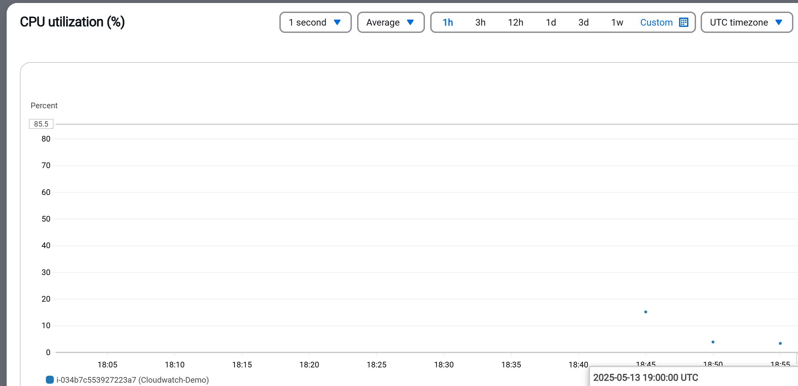
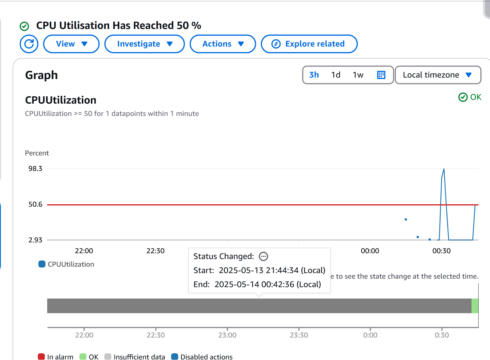
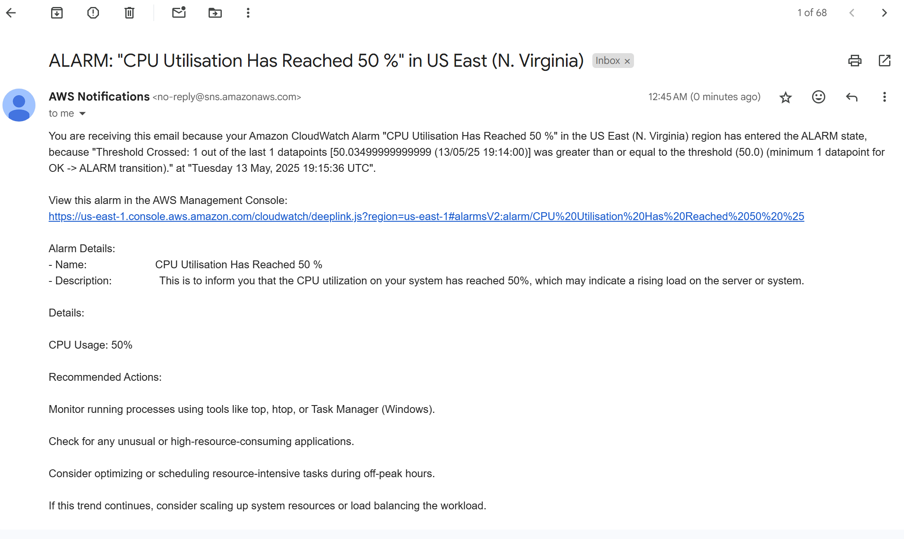

# AWS CloudWatch CPU Utilization Alert with SNS Notification

This project demonstrates real-time monitoring and alerting using **Amazon CloudWatch** and **Amazon SNS** on an **AWS EC2 instance**. It showcases how to monitor CPU usage, simulate a spike, and automatically notify users when the CPU utilization exceeds a specified threshold (in this case, 50%).

---

## 📌 Project Overview

In this project, I have:

- Launched an **EC2 instance** on AWS.
- Verified the CPU usage was initially idle (~0%).
- Written a **Python script** to simulate high CPU usage by spiking it beyond 50%.
- Created a **CloudWatch Alarm** that continuously monitors CPU utilization.
- Integrated **Amazon SNS** to send an **email alert** when CPU usage crosses the defined threshold.
- Captured screenshots to provide visual proof of each step.

This setup helps showcase how AWS monitoring and alerting tools can be used to maintain performance visibility and trigger proactive actions.

---

## 🛠️ Technologies Used

- **Amazon EC2** – to host the environment
- **Amazon CloudWatch** – to monitor CPU utilization
- **Amazon SNS (Simple Notification Service)** – to send alert emails
- **IAM** – for secure access and permissions
- **Python** – to simulate the CPU spike

---

## 🧪 Step-by-Step Workflow

1. **Launch EC2 Instance**
   - Created a t2.micro EC2 instance on AWS and configured it with necessary tools.

2. **Check Initial CPU Usage**
   - Verified and captured the CPU usage while the instance was idle (0%).

3. **Simulate CPU Load**
   - Used a Python script to spike the CPU load beyond 50%.

4. **Create CloudWatch Alarm**
   - Set an alarm on the **CPUUtilization** metric.
   - Threshold: 50% for 1 consecutive minute.

5. **Set Up SNS Notification**
   - Created an SNS topic and added an email subscription.
   - Verified email notification was sent upon alarm trigger.

6. **Monitor & Capture**
   - Captured screenshots before and after CPU spike.
   - Captured the email alert triggered by SNS.

---

## 📸 Screenshots

-   
  **[Before CPU Spike]** – Shows EC2 instance with idle CPU (~0%).

-   
  **[After CPU Spike]** – Shows CPU usage spiked above 50% after running the script.

- `
  **[Email Alert]** – Screenshot of the email received when the alarm triggered via SNS.

---

## 💡 What I Learned

- How to use **Amazon CloudWatch** to monitor EC2 metrics.
- How to create and configure **CloudWatch Alarms**.
- How to set up **Amazon SNS** to automate notifications.
- How to simulate and visualize resource utilization on EC2.
- Importance of monitoring and alerting in DevOps and cloud environments.

---

## 🔗 Future Improvements

- Extend monitoring to other metrics like memory and disk usage.
- Automate resource setup and teardown using Terraform or CloudFormation.
- Integrate Slack or webhook-based alerts for real-time team notifications.

---

## 👤 Author

**Mohit Dushyant Matte**  
[LinkedIn](https://www.linkedin.com/in/mohit-matte-a6496a240/)  
[Email](mailto:mattemohit2002@gmail.com)

---

